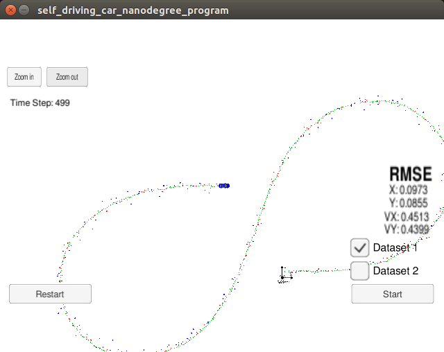

# Extended Kalman Filter Project Submission
####Udacity Self-Driving Car Nanodegree Program
####Term 2 Project 1

##Dependencies
For those who are interested in this work and are not involved in the Udacity self driving car nano degree you will need the following dependencies to run this project;
- [cmake >=3.5](https://cmake.org/install/)
- make >= 4.1 (Linux, Mac), 3.81 (Windows)
- gcc/g++ >= 5.4
- [uWebSocketIO](https://github.com/uWebSockets/uWebSockets)
- [Udacity Term 2 Simulator](https://github.com/udacity/self-driving-car-sim/releases)

## Basic Build Instructions

1. Clone this repo.
2. Make a build directory: `mkdir build && cd build`
3. Compile: `cmake .. && make` 
    	On windows, you may need to run: `cmake .. -G "Unix Makefiles" && make`
4. - Run: `./ExtendedKF `

# Extended Kalman Filter

Self driving cars use a variety of different sensors to understand the world around them, commonly used sensors include cameras, lidar and radar sensors. The primary reason for doing this is because different sensing methods have complementary advantadges and disadvantadges.

Characteristic |Camera |Lidar |Radar
----------------|-----------|--------|------
Resolution|Good | OK |Poor
Noise |Good |Bad |Bad 
Distance Measurment|Bad |Good | Good
Angular Measurement|Good |Good |Bad 
Velocity |Bad |Bad |Good 
Weather |Bad |Bad |Good
Size |Good |Bad |Good
Cost|Good| Bad| OK 

The aim of this project is to determine the location of an object using synthetic radar and a lidar data. The image below shows a screen shot from the [Udacity Term 2 Simulator](https://github.com/udacity/self-driving-car-sim/releases). The red dots indicate the location of a lidar measurement and the blue dots indicate radar. As you can see there is a significant amount of noise in the data to overcome this a technique called a kalman filter is used to produce a best estimate of the object location. The green dots show the predicated position calcualted using the Kalman filter.

